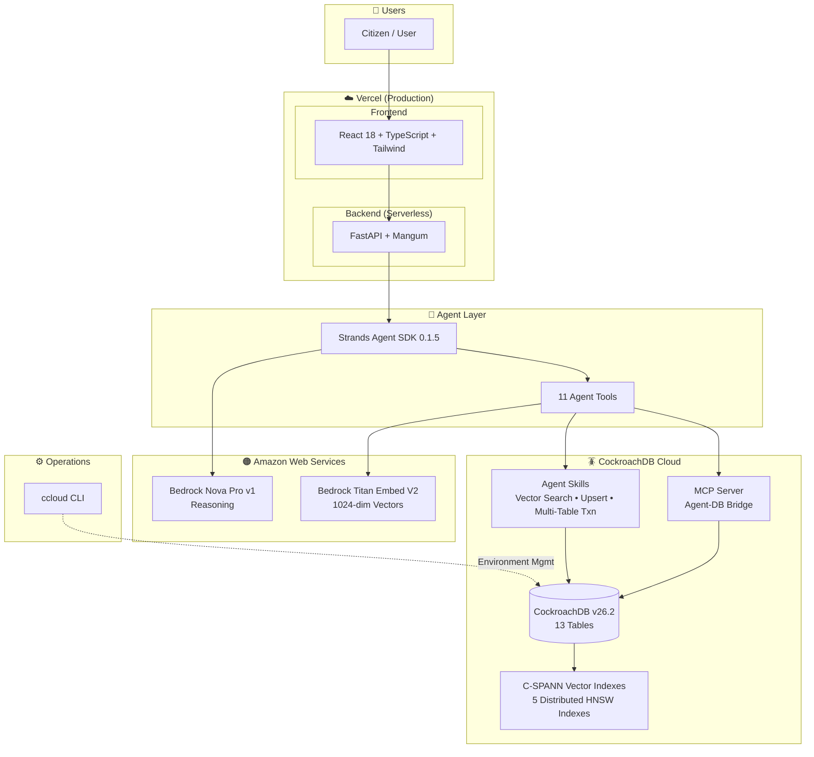
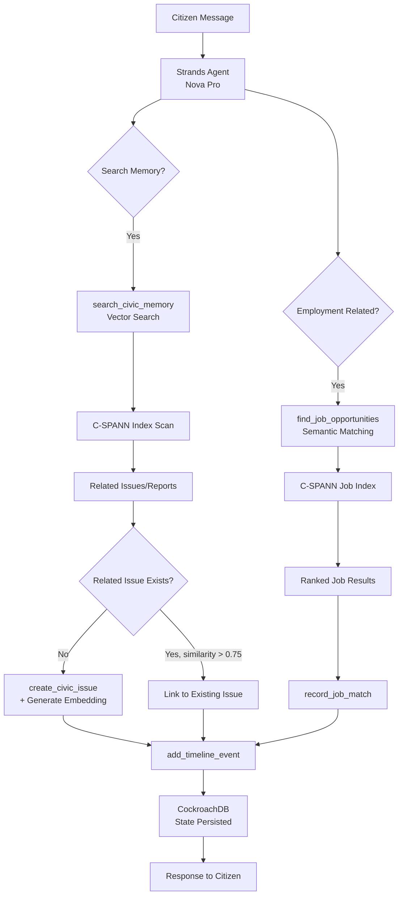
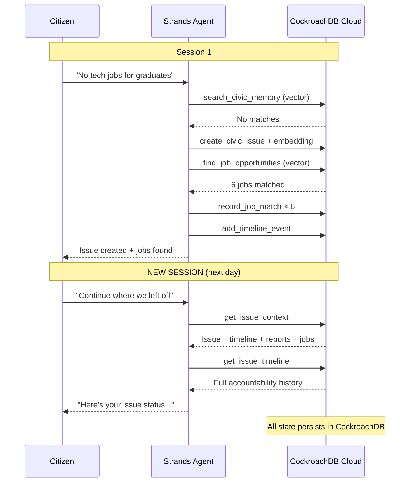
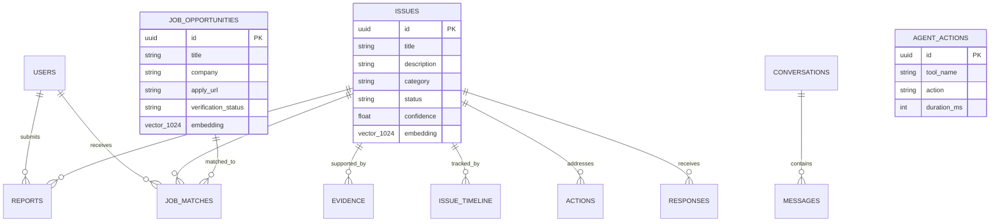
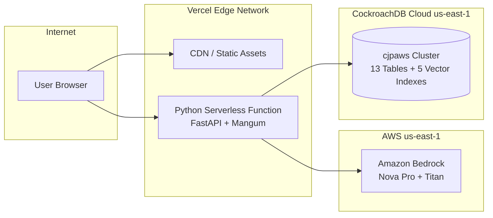

# CJP Architecture Diagrams

> Open [cjp-architecture.drawio](cjp-architecture.drawio) in https://app.diagrams.net for the interactive diagram.

---

## System Architecture

---

## Agent Decision Flow

---

## Cross-Session Memory Flow

---

## Data Model

---

## Deployment Architecture

---

## How to Open the draw.io File

1. Go to https://app.diagrams.net
2. Click **File → Open From → Device**
3. Select `docs/cjp-architecture.drawio`
4. The file contains 2 pages:
   - **Page 1**: Full system architecture with all components
   - **Page 2**: Agent data flow decision tree

Or view it directly on GitHub — `.drawio` files render as clickable diagrams.
