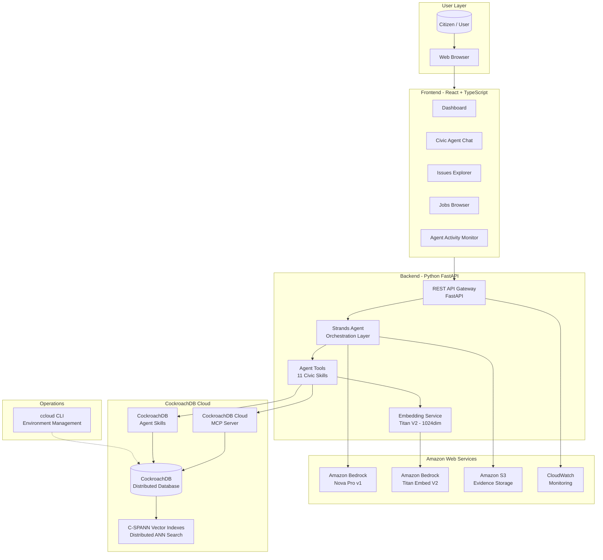
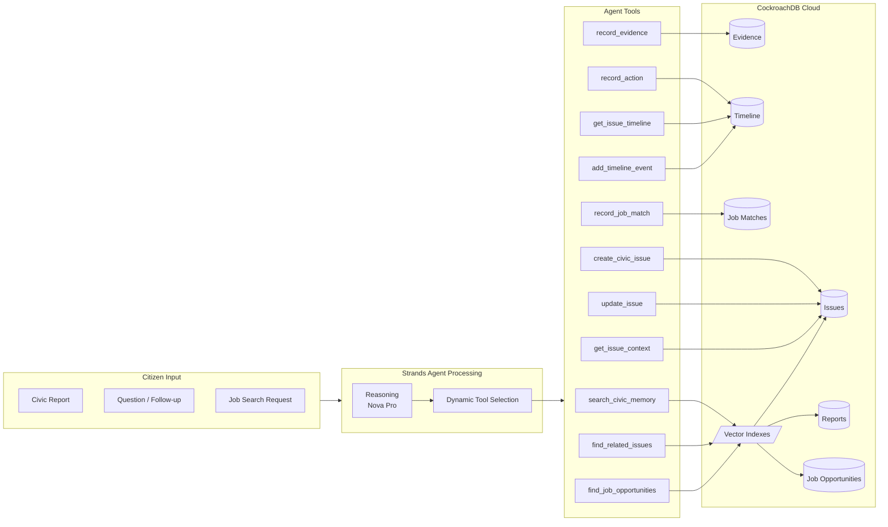
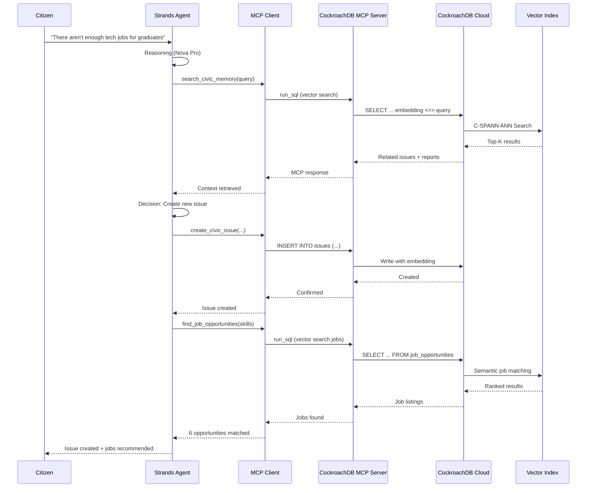
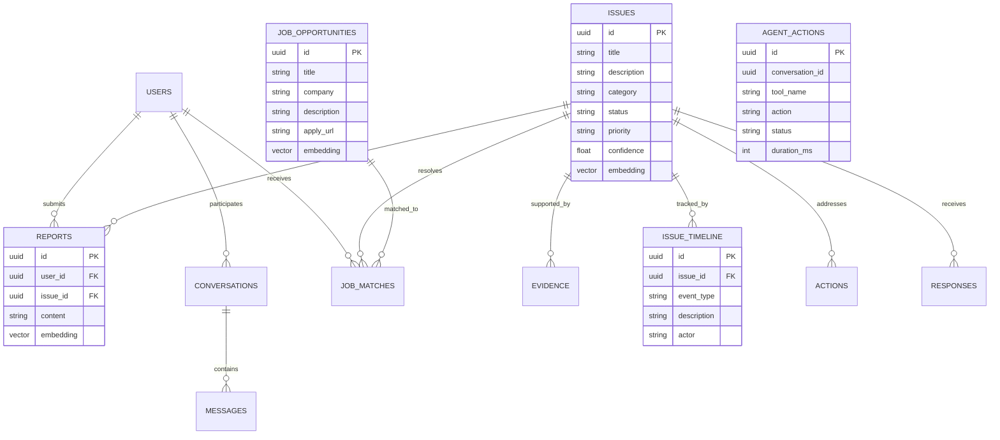

# CJP Architecture Diagram

## System Architecture (Draw.io Compatible)

The following diagram can be imported directly into [draw.io](https://app.diagrams.net/) using the XML below, or viewed as Mermaid diagrams.

### High-Level Architecture



### Data Flow Architecture



### MCP Integration Architecture



### Database Schema Diagram



---

## Draw.io XML Export

To import into draw.io, use **File > Import from > Text** and paste this XML:

```xml
<mxfile>
  <diagram name="CJP Architecture">
    <mxGraphModel>
      <root>
        <mxCell id="0"/>
        <mxCell id="1" parent="0"/>
        <!-- User -->
        <mxCell id="2" value="Citizen" style="shape=actor;whiteSpace=wrap;" vertex="1" parent="1">
          <mxGeometry x="380" y="20" width="40" height="60" as="geometry"/>
        </mxCell>
        <!-- Frontend -->
        <mxCell id="3" value="CJP Web App&#xa;React + TypeScript + Tailwind" style="rounded=1;whiteSpace=wrap;fillColor=#dae8fc;" vertex="1" parent="1">
          <mxGeometry x="300" y="120" width="200" height="50" as="geometry"/>
        </mxCell>
        <!-- API -->
        <mxCell id="4" value="FastAPI Gateway" style="rounded=1;whiteSpace=wrap;fillColor=#d5e8d4;" vertex="1" parent="1">
          <mxGeometry x="300" y="210" width="200" height="40" as="geometry"/>
        </mxCell>
        <!-- Agent -->
        <mxCell id="5" value="Strands Agent&#xa;Amazon Bedrock Nova Pro" style="rounded=1;whiteSpace=wrap;fillColor=#e1d5e7;" vertex="1" parent="1">
          <mxGeometry x="300" y="290" width="200" height="50" as="geometry"/>
        </mxCell>
        <!-- MCP -->
        <mxCell id="6" value="CockroachDB Cloud&#xa;MCP Server" style="rounded=1;whiteSpace=wrap;fillColor=#fff2cc;" vertex="1" parent="1">
          <mxGeometry x="180" y="390" width="150" height="50" as="geometry"/>
        </mxCell>
        <!-- CockroachDB -->
        <mxCell id="7" value="CockroachDB Cloud&#xa;Persistent Civic Memory" style="shape=cylinder3;whiteSpace=wrap;fillColor=#f8cecc;" vertex="1" parent="1">
          <mxGeometry x="300" y="490" width="200" height="70" as="geometry"/>
        </mxCell>
        <!-- Vector -->
        <mxCell id="8" value="C-SPANN&#xa;Distributed Vector Indexes" style="rounded=1;whiteSpace=wrap;fillColor=#ffe6cc;" vertex="1" parent="1">
          <mxGeometry x="470" y="390" width="150" height="50" as="geometry"/>
        </mxCell>
        <!-- Agent Skills -->
        <mxCell id="9" value="CockroachDB&#xa;Agent Skills" style="rounded=1;whiteSpace=wrap;fillColor=#fff2cc;" vertex="1" parent="1">
          <mxGeometry x="550" y="290" width="120" height="50" as="geometry"/>
        </mxCell>
        <!-- ccloud -->
        <mxCell id="10" value="ccloud CLI" style="rounded=1;whiteSpace=wrap;fillColor=#f5f5f5;" vertex="1" parent="1">
          <mxGeometry x="80" y="490" width="100" height="40" as="geometry"/>
        </mxCell>
        <!-- Bedrock -->
        <mxCell id="11" value="Amazon Bedrock&#xa;Titan Embed V2" style="rounded=1;whiteSpace=wrap;fillColor=#dae8fc;" vertex="1" parent="1">
          <mxGeometry x="80" y="290" width="140" height="50" as="geometry"/>
        </mxCell>
        <!-- Edges -->
        <mxCell id="e1" edge="1" source="2" target="3" parent="1"/>
        <mxCell id="e2" edge="1" source="3" target="4" parent="1"/>
        <mxCell id="e3" edge="1" source="4" target="5" parent="1"/>
        <mxCell id="e4" edge="1" source="5" target="6" parent="1"/>
        <mxCell id="e5" edge="1" source="5" target="8" parent="1"/>
        <mxCell id="e6" edge="1" source="5" target="9" parent="1"/>
        <mxCell id="e7" edge="1" source="6" target="7" parent="1"/>
        <mxCell id="e8" edge="1" source="8" target="7" parent="1"/>
        <mxCell id="e9" edge="1" source="9" target="7" parent="1"/>
        <mxCell id="e10" edge="1" source="5" target="11" parent="1"/>
        <mxCell id="e11" edge="1" source="10" target="7" style="dashed=1;" parent="1"/>
      </root>
    </mxGraphModel>
  </diagram>
</mxfile>
```

---

## Technology Summary

| Component | Technology | Role |
|-----------|-----------|------|
| Frontend | React 18 + TypeScript + Tailwind CSS | User interface |
| Backend | Python 3.11 + FastAPI | API server |
| Agent | Strands Agents SDK 0.1.5 | Orchestration |
| LLM | Amazon Bedrock Nova Pro v1 | Reasoning |
| Embeddings | Amazon Bedrock Titan Embed V2 | 1024-dim vectors |
| Database | CockroachDB Cloud v26.2 | Persistent memory |
| Vector Index | C-SPANN (distributed ANN) | Semantic search |
| MCP | CockroachDB Cloud MCP Server | Agent-DB bridge |
| Skills | CockroachDB Agent Skills | Reusable DB ops |
| CLI | ccloud CLI | Cluster management |
