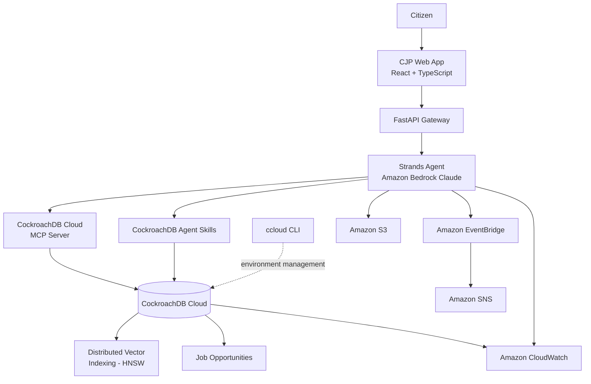

# CJP Architecture

## Overview

CJP (Civic Journey Platform) is an agentic system where the AI agent uses CockroachDB as its persistent memory and state layer. It is not a chatbot with a database — the agent autonomously decides what tools to use and when.

## System Architecture



## Technology Stack

| Layer | Technology | Purpose |
|-------|-----------|---------|
| Frontend | React + TypeScript + Tailwind | Dashboard UI |
| API | FastAPI (Python) | REST API gateway |
| Agent | Strands Agents SDK | Orchestration + reasoning |
| AI Model | Amazon Bedrock (Claude) | Language understanding |
| Database | CockroachDB Cloud | Persistent state + memory |
| MCP | CockroachDB Cloud MCP Server | Agent-to-DB bridge |
| Vectors | CockroachDB Distributed Vector Indexing | Semantic search |
| Skills | CockroachDB Agent Skills | Reusable DB capabilities |
| CLI | ccloud CLI | Environment management |

## Data Flow

```
Citizen Report
      |
      v
FastAPI receives request
      |
      v
Strands Agent activated
      |
      v
Agent reasons about what tools to use
      |
      +--> search_civic_memory (Vector Search via CockroachDB)
      |         |
      |         v
      |    Related issues found? 
      |         |
      |    Yes: Link report to existing issue
      |    No:  Create new civic issue
      |
      +--> find_job_opportunities (if employment-related)
      |         |
      |         v
      |    Semantic job matching via vector index
      |
      +--> record_action / add_timeline_event
      |         |
      |         v
      |    Accountability timeline updated
      |
      v
Response returned to citizen
      |
      v
All state persisted in CockroachDB
```

## Key Design Decisions

1. **Agent-First Architecture**: The Strands agent decides the flow, not hardcoded logic
2. **CockroachDB as Memory**: All agent state persists across sessions
3. **Vector-Native**: Embeddings stored alongside relational data in CockroachDB
4. **MCP Bridge**: Agent accesses database through the MCP protocol
5. **Accountability by Design**: Every action is recorded in the timeline
