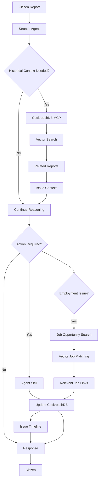

# Hackathon Evidence Matrix

## CockroachDB x AWS Hackathon — Evidence of Tool Usage

### Evidence Summary

| Capability | Actual Implementation | Demo Evidence |
|-----------|----------------------|---------------|
| CockroachDB MCP | Agent queries/writes through MCP server | Agent Activity panel shows MCP operations |
| Distributed Vector Indexing | HNSW indexes on issues, reports, jobs, evidence | Related reports found with similarity scores |
| ccloud CLI | Cluster creation, schema deployment, connection config | Setup docs + terminal commands documented |
| CockroachDB Agent Skills | Transactional upsert, vector search, multi-table transactions | Tool execution visible in Agent Activity |
| Strands Agents SDK | Agent orchestration with dynamic tool selection | Agent Activity shows reasoning flow |
| Amazon Bedrock | Claude for reasoning, Titan for embeddings | Agent responses + vector search results |
| Persistent Memory | Issues/timeline/jobs survive across sessions | New-session demo recovers full context |

---

### CockroachDB Cloud MCP Server

**What it does**: Provides an MCP-protocol interface between the Strands agent and CockroachDB Cloud.

**Where it is used**: `backend/src/mcp/client.py` — MCPClient connects to the official `@cockroachlabs/ccloud-mcp-server`.

**What the agent does with it**: Executes SQL queries, retrieves issue context, stores new data, all through the MCP protocol.

**What data flows through it**: Civic issues, reports, evidence, timeline events, job matches — all persistent state.

**How it contributes to CJP**: Enables the agent to treat CockroachDB as its persistent memory layer without direct database coupling.

---

### Distributed Vector Indexing

**What it does**: Enables semantic similarity search across distributed CockroachDB nodes using HNSW indexes.

**Where it is used**:
- `backend/migrations/002_vector_indexes.sql` — index definitions
- `backend/src/vector/search.py` — search implementation
- `backend/src/agent/tools/civic_memory.py` — agent tool
- `backend/src/agent/tools/jobs.py` — job matching

**What data is indexed**:
- Issues (1024-dim embeddings from Titan V2)
- Reports (for finding duplicates)
- Evidence (for semantic retrieval)
- Responses (for finding related responses)
- Job opportunities (for career matching)

**Demo evidence**: When a user reports "technology jobs for graduates", vector search finds reports about "software careers", "IT opportunities", "engineering employment" with similarity scores > 0.75.

---

### ccloud CLI

**What it does**: Manages the CockroachDB Cloud environment lifecycle.

**Where it is used**: Documented in `docs/ccloud-setup.md` with actual commands for:
- Authentication (`ccloud auth login`)
- Cluster creation (`ccloud cluster create cjp-cluster`)
- Database creation (`ccloud cluster sql --execute "CREATE DATABASE cjp"`)
- Schema deployment (`ccloud cluster sql < migrations/001_initial_schema.sql`)
- Connection configuration (`ccloud cluster sql --connection-url`)
- API key creation (`ccloud auth api-key create`)

**Limitation**: ccloud is a development/operations tool, not a runtime tool. It is used meaningfully during setup and environment management, not during request processing.

---

### CockroachDB Agent Skills

**What it does**: Provides reusable database capabilities optimized for CockroachDB.

**Where it is used**: `backend/src/skills/cockroachdb_skills.py`

**Skills implemented**:
- `transactional_upsert` — Idempotent writes with conflict resolution
- `vector_similarity_search` — Distributed vector search abstraction
- `multi_table_transaction` — Atomic multi-table operations
- `store_with_embedding` — Combined data + embedding storage
- `get_table_stats` — Schema awareness for agent decisions

**How they compose with CJP tools**: Each CJP application skill (create_civic_issue, find_job_opportunities, etc.) is built on top of these CockroachDB skills.

---

### Strands Agents SDK

**What it does**: Provides the agent orchestration framework with dynamic tool selection.

**Where it is used**: `backend/src/agent/civic_agent.py`

**How Strands decides when to call tools**: The agent receives a system prompt with strategic guidance, but Claude's native tool-calling capability makes the actual decision at inference time. The agent is not following a fixed sequence — it reasons about what tools to use based on the message content.

**Demo evidence**: Agent Activity panel shows different tool sequences for different inputs:
- Report → search_civic_memory → create_civic_issue → add_timeline_event
- Job query → find_job_opportunities → record_job_match
- Resume → get_issue_context → get_issue_timeline

---

### Amazon Bedrock

**What it does**: Provides AI reasoning (Claude) and embedding generation (Titan).

**Models used**:
- `anthropic.claude-3-5-sonnet-20241022-v2:0` — Agent reasoning
- `amazon.titan-embed-text-v2:0` — 1024-dim embeddings

**Demo evidence**: Agent generates contextual, tool-informed responses. Vector searches return semantically relevant results (not keyword matches).

---

### Persistent Memory

**What it does**: Agent state survives across sessions via CockroachDB.

**Demo**: 
1. Session 1: Report issue, agent creates issue + timeline + job matches
2. Session 2: "Continue where we left off" — agent retrieves full context from CockroachDB

**Implementation**: `backend/src/api/memory.py` + `get_issue_context` agent tool

---

## Complete Agent Flow

## What is NOT Claimed

- ccloud is NOT used at runtime — it is an operations/development tool
- The MCP server is used through the official SDK, not custom implementations
- Job listings are only returned if they exist in the database with verification_status = 'verified'
- The agent does NOT automatically apply for jobs
- Unverified claims are labeled as such
