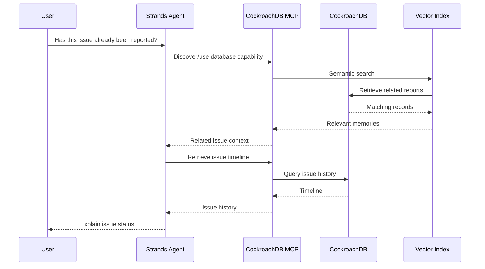

# CockroachDB MCP Server Integration

## Overview

CJP uses the official CockroachDB Cloud MCP Server as the bridge between the Strands agent and CockroachDB Cloud. This enables the agent to interact with the database through the Model Context Protocol.

Official documentation: https://www.cockroachlabs.com/docs/cockroachcloud/connect-to-the-cockroachdb-cloud-mcp-server

## Architecture

```
Strands Agent
      |
      v
MCP Client (src/mcp/client.py)
      |
      v
CockroachDB Cloud MCP Server (@cockroachlabs/ccloud-mcp-server)
      |
      v
CockroachDB Cloud Cluster
```

## Sequence Diagram



## MCP Tools Used

The CockroachDB Cloud MCP Server provides these tools that CJP uses:

| Tool | Purpose in CJP |
|------|---------------|
| `run_sql` | Execute queries for civic data retrieval and storage |
| `get_clusters` | Verify cluster connectivity |
| `get_databases` | List available databases |
| `get_tables` | Discover schema structure |
| `get_table_schema` | Inspect table definitions |

## Implementation

The MCP client is implemented in `backend/src/mcp/client.py`:

```python
class CockroachDBMCPClient:
    """Client for CockroachDB Cloud MCP Server."""

    async def connect(self):
        """Initialize connection via stdio transport."""
        server_params = StdioServerParameters(
            command="npx",
            args=["-y", "@cockroachlabs/ccloud-mcp-server"],
            env={
                "COCKROACHDB_API_KEY": self.config.api_key,
                "COCKROACHDB_CLUSTER_NAME": self.config.cluster_name,
            },
        )
        # ... establish MCP session

    async def run_sql(self, query: str) -> MCPToolResult:
        """Execute SQL via the MCP server's run_sql tool."""
        result = await self._session.call_tool("run_sql", arguments={"query": query})
        return MCPToolResult(tool_name="run_sql", success=True, data=result.content)
```

## What the Agent Does with MCP

1. **Memory Retrieval**: When a user says "continue where we left off", the agent uses MCP to query CockroachDB for the previous conversation context, linked issues, and timeline.

2. **Issue Creation**: When the agent determines a new civic issue should be created, it writes to CockroachDB through MCP, persisting the issue with its embedding.

3. **Semantic Search**: The agent uses MCP to execute vector similarity queries against the distributed vector indexes.

4. **Timeline Tracking**: Every agent action is recorded through MCP to maintain the accountability timeline.

5. **Job Matching**: Employment-related queries trigger MCP-mediated vector searches across the job_opportunities table.

## Data Flow Through MCP

```
User Message
    |
    v
Strands Agent (reasoning)
    |
    v
MCP Tool Discovery (list available operations)
    |
    v
run_sql: "SELECT ... FROM issues WHERE embedding <=> $1::VECTOR ORDER BY ..."
    |
    v
CockroachDB Cloud (distributed vector index scan)
    |
    v
Results returned through MCP
    |
    v
Agent reasoning (with database context)
    |
    v
MCP: INSERT into issue_timeline, agent_actions
    |
    v
Response to user (with persistent state updated)
```

## Configuration

The MCP server requires:
- `COCKROACHDB_API_KEY`: CockroachDB Cloud API key for authentication
- `COCKROACHDB_CLUSTER_NAME`: Target cluster name

These are configured via environment variables and never committed to source.
